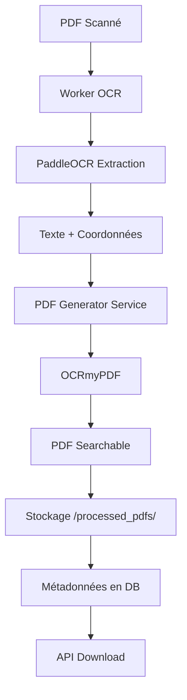

# 📄 PDF Generation Service - Guide d'utilisation

## Vue d'ensemble

Le service OCR de KAURI génère désormais automatiquement des **PDFs avec texte sélectionnable** (searchable PDFs) à partir de PDFs scannés ou image-based.

### Fonctionnalités

✅ **Génération automatique** de PDFs searchable après OCR
✅ **OCRmyPDF** - Technologie éprouvée et fiable
✅ **Support multi-langues** (Français, Anglais)
✅ **Optimisation automatique** de la taille des fichiers
✅ **Détection intelligente** - Skip les pages déjà OCRisées
✅ **API REST** pour télécharger et régénérer les PDFs

---

## 🔧 Installation

### 1. Dépendances système (Docker)

Le Dockerfile inclut maintenant :
```dockerfile
tesseract-ocr          # Moteur OCR
tesseract-ocr-fra      # Langue française
tesseract-ocr-eng      # Langue anglaise
ghostscript            # Manipulation PDF
img2pdf                # Conversion image vers PDF
pngquant               # Optimisation images
unpaper                # Nettoyage de pages
```

### 2. Dépendances Python

Ajoutées dans `requirements.txt` :
```txt
ocrmypdf==16.0.0       # Générateur de PDFs searchable
pytesseract==0.3.10    # Wrapper Python pour Tesseract
```

### 3. Rebuild du service

```bash
cd backend/kauri_ocr_service
docker-compose build ocr-service
docker-compose up -d ocr-service
```

---

## 🚀 Utilisation

### 1. Workflow automatique

Lorsqu'un PDF est traité par le worker OCR, le système génère **automatiquement** :

1. **Extraction du texte** avec PaddleOCR
2. **Génération du PDF searchable** avec OCRmyPDF
3. **Stockage** dans `/app/processed_pdfs/`
4. **Métadonnées** ajoutées à la base de données

```python
# Le worker fait automatiquement :
if file_path.endswith('.pdf'):
    pdf_result = await pdf_generator_service.generate_searchable_pdf(
        input_pdf_path=file_path,
        output_filename=f"{document.id}_searchable.pdf"
    )
```

### 2. API Endpoints

#### Télécharger le PDF searchable

```http
GET /api/v1/ocr/document/{document_id}/searchable-pdf?tenant_id={tenant_id}
```

**Réponse** : Fichier PDF (application/pdf)

**Exemple avec curl :**
```bash
curl -X GET "http://localhost:8003/api/v1/ocr/document/{UUID}/searchable-pdf?tenant_id={UUID}" \
  -H "Authorization: Bearer {token}" \
  -o output_searchable.pdf
```

#### Régénérer le PDF searchable

```http
POST /api/v1/ocr/document/{document_id}/regenerate-pdf?tenant_id={tenant_id}
```

**Réponse :**
```json
{
  "message": "Searchable PDF regenerated successfully",
  "document_id": "uuid-here",
  "output_path": "/app/processed_pdfs/uuid_searchable.pdf",
  "file_size": 1234567
}
```

**Cas d'usage** :
- Le fichier a été supprimé
- La génération initiale a échoué
- Mise à jour des paramètres OCR

### 3. Utilisation programmatique

```python
from app.services.pdf_generator import pdf_generator_service

# Générer un PDF searchable
result = await pdf_generator_service.generate_searchable_pdf(
    input_pdf_path="/path/to/scanned.pdf",
    output_filename="searchable.pdf"
)

if result['success']:
    print(f"PDF créé : {result['output_path']}")
    print(f"Taille : {result['file_size']} bytes")
else:
    print(f"Erreur : {result['error']}")

# Créer un PDF à partir d'images
result = await pdf_generator_service.generate_pdf_from_images(
    image_paths=["/path/to/img1.jpg", "/path/to/img2.jpg"],
    output_filename="from_images.pdf",
    apply_ocr=True
)

# Optimiser un PDF existant
result = await pdf_generator_service.optimize_pdf(
    input_pdf_path="/path/to/large.pdf",
    output_filename="optimized.pdf",
    optimization_level=2  # 0=none, 1=safe, 2=lossy, 3=aggressive
)
```

---

## 📊 Configuration

### Variables d'environnement

```env
# Langues OCR (mappées vers Tesseract)
OCR_LANG=fr,en  # Devient "fra+eng" pour Tesseract

# Qualité et performance
WORKER_CONCURRENCY=4  # Nombre de jobs parallèles

# Seuils de qualité
OCR_MIN_CONFIDENCE=0.6
OCR_MIN_QUALITY_SCORE=0.7
OCR_REQUIRES_REVIEW_THRESHOLD=0.8
```

### Options OCRmyPDF

Le service utilise les paramètres suivants par défaut :

```python
{
    "language": "fra+eng",        # Langues Tesseract
    "output_type": "pdfa",        # Format PDF/A (archival)
    "optimize": 1,                # Optimisation légère
    "deskew": True,               # Redresser les pages
    "clean": True,                # Nettoyer avant OCR
    "skip_text": True,            # Skip pages avec texte
    "force_ocr": False,           # Ne pas forcer re-OCR
    "rotate_pages": True,         # Auto-rotation
    "jobs": 4                     # Traitement parallèle
}
```

---

## 🧪 Tests

### Script de test

```bash
cd backend/kauri_ocr_service

# Placer un PDF de test
cp /path/to/test.pdf test_input.pdf

# Lancer le test
python test_pdf_generation.py
```

**Le script teste :**
1. ✅ Génération de PDF searchable
2. ✅ Optimisation de PDF
3. ✅ Création de PDF depuis images
4. ✅ Méthodes du service (file_exists, get_output_path)

**Sortie attendue :**
```
======================================================================
Testing PDF Generator Service
======================================================================

✅ Found test input: test_input.pdf
   File size: 1,234,567 bytes

======================================================================
TEST 1: Generate Searchable PDF
======================================================================
✅ Success!
   Output: test_searchable.pdf
   Path: /app/processed_pdfs/test_searchable.pdf
   Size: 1,345,678 bytes
   Message: Searchable PDF generated successfully
✅ Output file verified on disk
   Size increased by 9.0%

======================================================================
✅ ALL TESTS PASSED!
======================================================================
```

---

## 📁 Structure des fichiers

```
backend/kauri_ocr_service/
├── app/
│   ├── services/
│   │   ├── ocr_engine.py           # Service OCR (existant)
│   │   └── pdf_generator.py        # ⭐ Nouveau service PDF
│   ├── workers/
│   │   └── ocr_worker.py            # ✏️ Modifié (génération auto)
│   └── api/routes/
│       └── ocr.py                   # ✏️ Nouvelles routes API
├── processed_pdfs/                  # ⭐ Dossier de sortie
├── test_pdf_generation.py           # ⭐ Script de test
├── requirements.txt                 # ✏️ Dépendances ajoutées
└── Dockerfile                       # ✏️ Tesseract installé
```

---

## 🔍 Workflow complet



---

## 💡 Cas d'usage avancés

### 1. Réingestion avec nouveau PDF

Si vous voulez réingérer des documents existants pour générer les PDFs searchable :

```python
# Script de migration
from app.models.ocr_document import OCRDocument
from app.services.pdf_generator import pdf_generator_service

async def migrate_existing_documents():
    documents = await get_all_pdf_documents()

    for doc in documents:
        if doc.file_path.endswith('.pdf'):
            result = await pdf_generator_service.generate_searchable_pdf(
                input_pdf_path=doc.file_path,
                output_filename=f"{doc.id}_searchable.pdf"
            )

            if result['success']:
                doc.metadata['searchable_pdf_path'] = result['output_path']
                await save(doc)
```

### 2. Batch processing

Pour traiter plusieurs PDFs en batch :

```bash
# Dans le conteneur
docker exec -it kauri-ocr-service-1 python -c "
from app.services.pdf_generator import pdf_generator_service
import asyncio

async def batch():
    pdfs = ['file1.pdf', 'file2.pdf', 'file3.pdf']
    for pdf in pdfs:
        result = await pdf_generator_service.generate_searchable_pdf(pdf)
        print(result)

asyncio.run(batch())
"
```

### 3. Intégration avec scraping

Pour les documents scrapés depuis `scraping/` :

```python
# Dans votre script de scraping
from pathlib import Path
from app.services.pdf_generator import pdf_generator_service

scraped_pdfs = Path("scraping/doctrines/").glob("*.pdf")

for pdf_path in scraped_pdfs:
    result = await pdf_generator_service.generate_searchable_pdf(
        input_pdf_path=str(pdf_path),
        output_filename=f"{pdf_path.stem}_searchable.pdf"
    )
```

---

## ⚠️ Limitations et considérations

### Taille des fichiers

- PDFs searchable sont généralement **5-15% plus gros** que les originaux
- Utiliser `optimize_pdf()` pour réduire la taille si nécessaire
- Les très gros PDFs (>100 pages) peuvent prendre plusieurs minutes

### Qualité OCR

- **Tesseract** (via OCRmyPDF) peut avoir une qualité différente de **PaddleOCR**
- Le texte extrait par PaddleOCR est stocké en base
- Le PDF searchable utilise Tesseract pour la couche texte invisible
- Les deux extractions peuvent différer légèrement

### Performance

- Génération CPU-intensive
- Utiliser `WORKER_CONCURRENCY` pour optimiser
- Sur un système moyen : ~30 secondes par PDF de 10 pages

---

## 🐛 Troubleshooting

### Erreur : "Tesseract not found"

```bash
# Vérifier installation
docker exec -it kauri-ocr-service-1 tesseract --version

# Réinstaller si nécessaire
docker-compose build --no-cache ocr-service
```

### Erreur : "Language 'fra' not found"

```bash
# Vérifier langues installées
docker exec -it kauri-ocr-service-1 tesseract --list-langs

# Installer manuellement
docker exec -it kauri-ocr-service-1 apt-get update
docker exec -it kauri-ocr-service-1 apt-get install -y tesseract-ocr-fra
```

### PDF non généré automatiquement

1. Vérifier les logs du worker :
   ```bash
   docker logs kauri-ocr-service-1 --tail 100
   ```

2. Vérifier le dossier de sortie :
   ```bash
   docker exec -it kauri-ocr-service-1 ls -la /app/processed_pdfs/
   ```

3. Tester manuellement :
   ```bash
   docker exec -it kauri-ocr-service-1 python test_pdf_generation.py
   ```

---

## 📚 Ressources

- [OCRmyPDF Documentation](https://ocrmypdf.readthedocs.io/)
- [Tesseract OCR](https://github.com/tesseract-ocr/tesseract)
- [PaddleOCR](https://github.com/PaddlePaddle/PaddleOCR)

---

## 🎯 Prochaines étapes

- [ ] Ajouter support pour plus de langues (Espagnol, Arabe)
- [ ] Intégration avec MinIO pour stockage distribué
- [ ] Webhook pour notifications de fin de traitement
- [ ] Interface web pour visualiser les PDFs searchable
- [ ] Comparaison qualité PaddleOCR vs Tesseract
- [ ] Support pour documents multi-colonnes
- [ ] Extraction de tables avancée

---

**Développé pour KAURI - Expertise comptable OHADA** 🇫🇷🇨🇮
